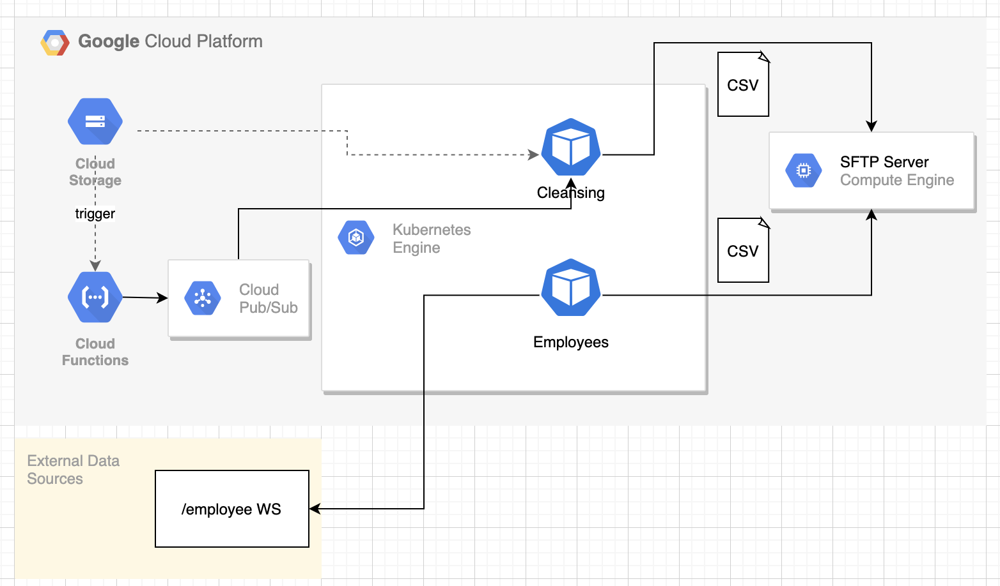

# Sample Retail - Microservicios en GCP

Arquitectura de microservicios en Google Cloud Platform que demuestra integración entre Cloud Functions, Pub/Sub, Cloud Storage y servicios Spring Boot.

## 📋 Descripción

Sample Retail es un proyecto de demostración que muestra una arquitectura completa de microservicios en GCP. Incluye servicios Spring Boot que se comunican mediante Pub/Sub, procesamiento de archivos en Cloud Storage y funciones serverless.



## 🏗️ Arquitectura

La arquitectura incluye:

1. **Microservicio Employees**: Consume API externa y genera archivos CSV en SFTP
2. **Microservicio Cleansing**: Escucha Pub/Sub, procesa archivos de GCS y enmascara datos
3. **Cloud Functions**: Trigger cuando llegan archivos al bucket de Cloud Storage
4. **Pub/Sub**: Mensajería asíncrona entre servicios
5. **Cloud Storage**: Almacenamiento de archivos

## 🚀 Componentes

### Microservicio 1 - Employees

**Ubicación**: `employees/`

**Funcionalidad**:
- ✅ Consume web service: `http://dummy.restapiexample.com/api/v1/employees`
- ✅ Genera archivo CSV con los datos
- ✅ Sube el archivo CSV al servidor SFTP

**Ver documentación**: [employees/README.md](./employees/README.md)

### Microservicio 2 - Cleansing

**Ubicación**: `cleansing/`

**Funcionalidad**:
- ✅ Escucha mensajes de Pub/Sub
- ✅ Procesa archivos desde Google Cloud Storage
- ✅ Enmascara u ofusca columnas sensibles (nombres)
- ✅ Sube el archivo procesado al servidor SFTP

**Nota**: Este servicio también puede subir archivos al bucket de GCS y enviar mensajes a Pub/Sub.

**Ver documentación**: [cleansing/README.md](./cleansing/README.md)

### Cloud Function

**Funcionalidad**:
- ✅ Trigger cuando llega un archivo al bucket de Cloud Storage
- ✅ Procesa el archivo si es necesario
- ✅ Mueve el archivo procesado al SFTP

**Nota**: Alternativamente, la Cloud Function puede escuchar mensajes de Pub/Sub para procesar archivos que ya están en el store de GCP.

## 📋 Requisitos

- Java 21+
- Maven 3.6+
- Google Cloud SDK
- Acceso a Google Cloud Project con:
  - Cloud Storage habilitado
  - Pub/Sub habilitado
  - Cloud Functions habilitado
  - Service Account con permisos apropiados
- Acceso a servidor SFTP

## ⚙️ Configuración

### Variables de Entorno GCP

```bash
# GCP Configuration
export GCP_PROJECT_ID=your-project-id
export GOOGLE_APPLICATION_CREDENTIALS=/path/to/service-account-key.json

# Pub/Sub
export PUBSUB_TOPIC=cleansing-topic
export PUBSUB_SUBSCRIPTION=cleansing-subscription

# Cloud Storage
export GCS_BUCKET_NAME=cleansing-bucket

# SFTP
export SFTP_HOST=sftp.example.com
export SFTP_USER=username
export SFTP_PASS=password
```

### Habilitar APIs en GCP

```bash
# Habilitar APIs necesarias
gcloud services enable pubsub.googleapis.com
gcloud services enable storage.googleapis.com
gcloud services enable cloudfunctions.googleapis.com
gcloud services enable cloudbuild.googleapis.com
```

### Crear Recursos en GCP

```bash
# Crear topic de Pub/Sub
gcloud pubsub topics create cleansing-topic

# Crear subscription
gcloud pubsub subscriptions create cleansing-subscription --topic cleansing-topic

# Crear bucket de Cloud Storage
gsutil mb -p ${GCP_PROJECT_ID} -c STANDARD -l us-central1 gs://${GCS_BUCKET_NAME}
```

## 🏃 Ejecución Local

### Microservicio Employees

```bash
cd employees
./mvnw spring-boot:run -Dspring-boot.run.profiles=local
```

### Microservicio Cleansing

```bash
cd cleansing
./mvnw spring-boot:run -Dspring-boot.run.profiles=local
```

## ☁️ Despliegue en GCP

### Desplegar Microservicios

#### Con Cloud Build

```bash
# Desplegar Employees
cd employees
gcloud builds submit --config cloudbuild.yaml .

# Desplegar Cleansing
cd cleansing
gcloud builds submit --config cloudbuild.yaml .
```

#### Con Kubernetes

```bash
# Desplegar Employees
kubectl apply -f employees/k8/employee-service.yaml

# Verificar deployment
kubectl get pods -l app=employee-service
```

### Desplegar Cloud Function

```bash
# Deploy Cloud Function con trigger de Storage
gcloud functions deploy cleansing-function \
  --runtime java21 \
  --trigger-bucket ${GCS_BUCKET_NAME} \
  --entry-point com.cleansing.CloudFunctionHandler \
  --source . \
  --region us-central1 \
  --memory 512MB

# O con trigger de Pub/Sub
gcloud functions deploy cleansing-function \
  --runtime java21 \
  --trigger-topic cleansing-topic \
  --entry-point com.cleansing.CloudFunctionHandler \
  --source . \
  --region us-central1 \
  --memory 512MB
```

## 🔄 Flujo de Datos

### Flujo 1: Employees → SFTP

1. **Employees Service** consume API externa
2. Genera archivo CSV con datos de empleados
3. Sube el archivo CSV al servidor SFTP

### Flujo 2: Employees → GCS → Pub/Sub → Cleansing → SFTP

1. **Employees Service** consume API externa
2. Genera archivo CSV
3. Sube el archivo a Google Cloud Storage
4. Publica mensaje en Pub/Sub con ubicación del archivo
5. **Cleansing Service** recibe mensaje de Pub/Sub
6. Descarga archivo de GCS
7. Procesa y enmascara datos sensibles
8. Sube archivo procesado al servidor SFTP

### Flujo 3: Storage → Cloud Function → SFTP

1. Archivo llega al bucket de Cloud Storage
2. **Cloud Function** se dispara automáticamente
3. Cloud Function procesa el archivo
4. Cloud Function sube el archivo procesado al servidor SFTP

## 📡 API Endpoints

### Employees Service

- `POST /api/employee/search` - Busca empleados y genera CSV en SFTP
- `GET /api/employee/healthcheck` - Health check

### Cleansing Service

- `POST /cleansing/api/postMessage` - Publica mensaje para procesar archivo
- `GET /actuator/health` - Health check

## 🔐 Seguridad

### Service Accounts

Cada servicio debe usar un Service Account con permisos mínimos necesarios:

**Employees Service**:
- `storage.objects.create`
- `storage.objects.get`
- `pubsub.topics.publish`

**Cleansing Service**:
- `storage.objects.get`
- `pubsub.subscriptions.consume`
- `pubsub.topics.publish`

### Configuración de Red

- Usar VPC para comunicación entre servicios
- Configurar firewall rules apropiadas
- Usar Private IPs cuando sea posible

**Ver**: [../SECURITY_IMPROVEMENTS.md](../SECURITY_IMPROVEMENTS.md)

## 📊 Monitoreo

### Cloud Logging

Los servicios están configurados para enviar logs a Cloud Logging:

```bash
# Ver logs de Employees Service
gcloud logging read "resource.type=cloud_run_revision AND resource.labels.service_name=employees-service" --limit 50

# Ver logs de Cleansing Service
gcloud logging read "resource.type=cloud_run_revision AND resource.labels.service_name=cleansing-service" --limit 50
```

### Cloud Monitoring

Configurar alertas en Cloud Monitoring para:
- Errores en Pub/Sub
- Latencia de Cloud Functions
- Errores de conexión SFTP

## 🧪 Testing

### Testing Local

```bash
# Test Employees Service
cd employees
./mvnw test

# Test Cleansing Service
cd cleansing
./mvnw test
```

### Testing de Integración

1. Publicar mensaje de prueba en Pub/Sub:
```bash
gcloud pubsub topics publish cleansing-topic --message '{"bucketName":"my-bucket","fileName":"test.csv"}'
```

2. Subir archivo de prueba a GCS:
```bash
gsutil cp test.csv gs://${GCS_BUCKET_NAME}/test.csv
```

3. Verificar que Cloud Function se ejecutó:
```bash
gcloud functions logs read cleansing-function --limit 10
```

## 📝 Estructura del Proyecto

```
sample-retail/
├── employees/
│   ├── src/
│   ├── pom.xml
│   ├── cloudbuild.yaml
│   ├── k8/
│   │   └── employee-service.yaml
│   └── README.md
├── cleansing/
│   ├── src/
│   ├── pom.xml
│   ├── cloudbuild.yaml
│   └── README.md
├── move-employee-in-file/
│   ├── index.js
│   └── package.json
├── arquitectura-gcp.png
└── README.md
```

## 🔧 Troubleshooting

### Error: Pub/Sub subscription not found

Crear subscription:
```bash
gcloud pubsub subscriptions create cleansing-subscription --topic cleansing-topic
```

### Error: Cloud Storage bucket not found

Crear bucket:
```bash
gsutil mb -p ${GCP_PROJECT_ID} gs://${GCS_BUCKET_NAME}
```

### Error: SFTP connection failed

1. Verificar credenciales en configuración
2. Verificar conectividad de red
3. Verificar firewall rules en GCP

### Error: Cloud Function timeout

1. Aumentar timeout: `--timeout=540s`
2. Aumentar memoria: `--memory=1GB`
3. Optimizar código de la función

## 📞 Soporte

Para reportar issues o hacer preguntas:
1. Abre un issue en el repositorio
2. Revisa la documentación principal: [../README.md](../README.md)
3. Consulta documentación de GCP:
   - [Pub/Sub Documentation](https://cloud.google.com/pubsub/docs)
   - [Cloud Storage Documentation](https://cloud.google.com/storage/docs)
   - [Cloud Functions Documentation](https://cloud.google.com/functions/docs)

---

**Versión**: 1.0  
**Última actualización**: Enero 2025
